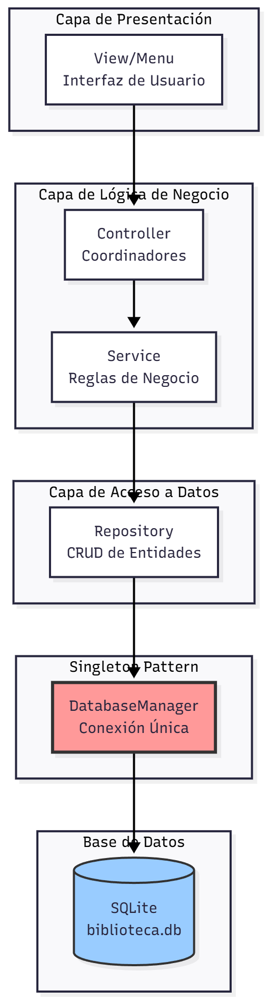
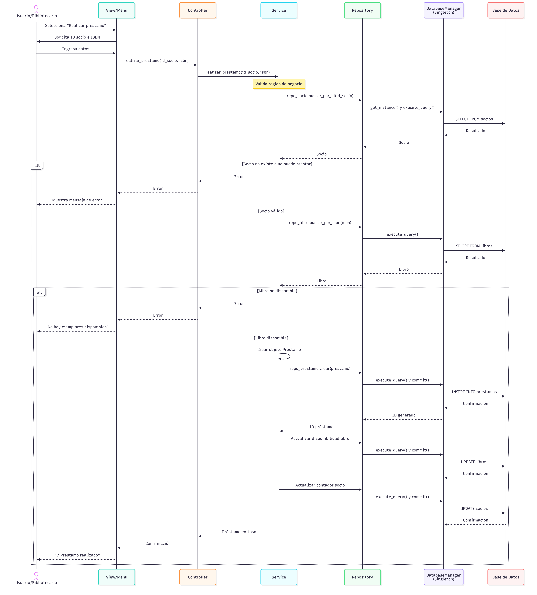

# SISTEMA DE GESTIÓN DE BIBLIOTECA

## Introducción

Este documento describe la arquitectura del sistema de gestión de biblioteca, identificando las tres capas principales del sistema y el patrón de diseño Singleton aplicado para resolver el acceso centralizado a la base de datos.

---

## Identificación de las Tres Capas Principales

### 1. Capa de Presentación (View)

**Responsabilidad**: Interactuar con el usuario final

**Ubicación**: `src/view/`

**Funciones**:
- Mostrar menú interactivo para bibliotecarios
- Capturar datos de entrada del usuario (libros, socios, préstamos)
- Validar formato de datos de entrada
- Mostrar resultados de operaciones
- Presentar reportes y estadísticas
- Gestionar la interfaz de usuario (UI)

**Componentes**:
- `Menu`: Clase principal que gestiona la interfaz de usuario
- Formularios para registro de socios y libros
- Visualización de catálogos y préstamos
- Interfaz para gestión de devoluciones

### 2. Capa de Lógica de Negocio (Service/Controller)

**Responsabilidad**: Implementar las reglas del negocio y coordinar operaciones

**Ubicación**: `src/service/` y `src/controller/`

**Funciones**:
- Validar si un socio puede realizar un préstamo (límite de libros, multas pendientes)
- Calcular fechas de devolución según el tipo de libro
- Aplicar multas por retraso en devoluciones
- Gestionar disponibilidad de ejemplares
- Verificar estado de membresía de socios
- Procesar búsquedas y filtros
- Coordinar entre capas de presentación y datos

**Componentes**:
- `LibroService`, `SocioService`, `PrestamoService`: Lógica de negocio
- `LibroController`, `SocioController`, `PrestamoController`: Coordinadores

### 3. Capa de Acceso a Datos (Repository/DAL)

**Responsabilidad**: Gestionar el acceso y persistencia de datos

**Ubicación**: `src/repository/` y `src/dal/`

**Funciones**:
- CRUD (Crear, Leer, Actualizar, Eliminar) de Socios
- CRUD de Libros y Ejemplares
- CRUD de Préstamos
- Gestionar transacciones de base de datos
- Consultas complejas (libros más prestados, socios morosos)
- Mantener integridad referencial
- Gestionar conexiones a la base de datos

**Componentes**:
- `LibroRepository`, `SocioRepository`, `PrestamoRepository`: Acceso a datos
- `DatabaseManager`: Gestión centralizada de la conexión (patrón Singleton)

---

## Problema y Patrón de Diseño

### Problema Identificado: Acceso Centralizado a la Base de Datos

**Descripción del problema**:
En un sistema de biblioteca, múltiples componentes necesitan acceder a la base de datos (para consultar libros, registrar préstamos, actualizar socios, etc.). Si cada componente crea su propia conexión a la base de datos, podemos enfrentar:
- Múltiples conexiones innecesarias que consumen recursos
- Inconsistencias en la configuración de conexión
- Dificultad para gestionar el pool de conexiones
- Problemas de concurrencia y bloqueos
- Violación de integridad de datos

### Patrón de Diseño Propuesto: **Singleton**

**¿Qué es Singleton?**
Es un patrón de diseño creacional que garantiza que una clase tenga una única instancia y proporciona un punto de acceso global a ella.

**¿Por qué Singleton para este problema?**
1. **Única instancia**: Asegura que solo exista una conexión/gestor de base de datos en todo el sistema
2. **Acceso global**: Todos los componentes pueden acceder a la misma instancia sin crear nuevas conexiones
3. **Control centralizado**: Facilita la gestión de la conexión, transacciones y cierre de recursos
4. **Eficiencia**: Reduce el overhead de crear múltiples conexiones
5. **Configuración única**: La configuración de la base de datos se define en un solo lugar
6. **Thread-safety**: Con protección mediante locks, permite operaciones concurrentes seguras

**Aplicación en nuestro sistema**:
- Clase `DatabaseManager` implementa el patrón Singleton
- Garantiza una única conexión a SQLite en todo el sistema
- Thread-safe mediante `threading.Lock()`
- Todas las operaciones de datos pasan por esta única instancia
- Control centralizado de transacciones (commit/rollback)

---

## Diagrama de Arquitectura UML - Capas del Sistema



---

## Diagrama de Clases UML - Patrón Singleton


---

## Diagrama de Secuencia - Flujo de un Préstamo



---

## Estructura de Carpetas del Sistema

```
src/
├── model/                      # Modelos de Dominio
│   ├── __init__.py
│   ├── libro.py               # Clase Libro
│   ├── socio.py               # Clase Socio
│   └── prestamo.py            # Clase Prestamo
│
├── dal/                       # Data Access Layer (Singleton)
│   ├── __init__.py
│   └── database_manager.py   # Patrón Singleton para BD
│
├── repository/                # Capa de Repositorios
│   ├── __init__.py
│   ├── libro_repository.py   # CRUD de Libros
│   ├── socio_repository.py   # CRUD de Socios
│   └── prestamo_repository.py # CRUD de Préstamos
│
├── service/                   # Lógica de Negocio
│   ├── __init__.py
│   ├── libro_service.py      # Validaciones y reglas de Libros
│   ├── socio_service.py      # Validaciones y reglas de Socios
│   └── prestamo_service.py   # Validaciones y reglas de Préstamos
│
├── controller/                # Controladores
│   ├── __init__.py
│   ├── libro_controller.py   # Coordina operaciones de Libros
│   ├── socio_controller.py   # Coordina operaciones de Socios
│   └── prestamo_controller.py # Coordina operaciones de Préstamos
│
├── view/                      # Vista (Interfaz de Usuario)
│   ├── __init__.py
│   └── menu.py               # Menú interactivo completo
│
├── main.py                    # Punto de entrada del sistema
└── demo.py                    # Script de demostración
```

---

## Validación del Modelo - Implementación Singleton

El sistema implementa el patrón Singleton en la clase `DatabaseManager`:

```python
class DatabaseManager:
    """
    Implementación del patrón Singleton para gestionar
    la conexión a la base de datos de forma centralizada.
    Thread-safe.
    """
    _instance = None
    _lock = threading.Lock()
    
    def __new__(cls):
        if cls._instance is None:
            with cls._lock:
                if cls._instance is None:
                    cls._instance = super().__new__(cls)
                    cls._instance._initialized = False
        return cls._instance
    
    @classmethod
    def get_instance(cls):
        """Método para obtener la única instancia"""
        return cls()
```

**Características del Singleton implementado**:
1. ✅ **Doble verificación** (Double-checked locking) para evitar crear instancias múltiples
2. ✅ **Thread-safe** mediante `threading.Lock()`
3. ✅ **Lazy initialization** - la conexión se crea solo cuando se necesita
4. ✅ **Acceso global** a través de `get_instance()`
5. ✅ **Configuración centralizada** del path de la base de datos

---

## Conclusiones

Este diseño arquitectónico del sistema de gestión de biblioteca demuestra:

1. **Separación clara de responsabilidades** en tres capas:
   - **Presentación**: Interacción con el usuario
   - **Lógica de Negocio**: Validaciones y reglas del sistema
   - **Acceso a Datos**: Persistencia y consultas

2. **Aplicación del patrón Singleton** para gestionar la conexión a la base de datos:
   - Una única instancia de conexión en todo el sistema
   - Thread-safety mediante locks
   - Gestión eficiente de recursos
   - Punto de acceso global y consistente

3. **Arquitectura escalable y mantenible**:
   - Facilita el testing unitario
   - Permite cambios en una capa sin afectar las otras
   - Promueve la reutilización de código
   - Fácil de extender con nuevas funcionalidades

4. **Código funcional** que valida el diseño propuesto en Python 3.7+ con SQLite
