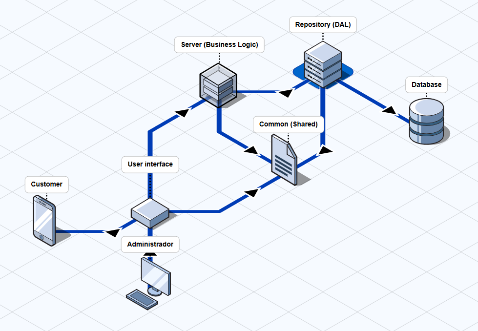
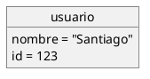

| Capa | Elementos|Responsabilidad|Código fuente|
|--|--|--|--|
|Server|Lógica del negocio|Encargado de recibir las peticiones de la user interface e indicárselas al repositorio|TODO|
|Repository|Data access layer|Encargado de recibir mensajes desde el server y llamar a la Base de datos|TODO|
|Base de datos|Base de datos sqlite|Encargar de persistir datos del negocio|TODO|
|User interface|Vista al usuario|Encargado de presentar al usuario una fácil comunicación con la lógica de negocio|TODO|
|Repository|Data access layer|Encargado de recibir mensajes desde el server y llamar a la Base de datos|TODO|
|Common|Clases de dominio|Encargado de permitir la comunicación entre UI, Server y Repository|TODO|
|Customer|Cliente (compras, carrito, descuentos, pagos)|Cliente que tiene su vista para interactuar con el negocio.|TODO|
|Administrador|Administrador (ventas, stock, descuentos, cobros)|Administrador que tiene su vista para interactuar con el negocio.|TODO|

